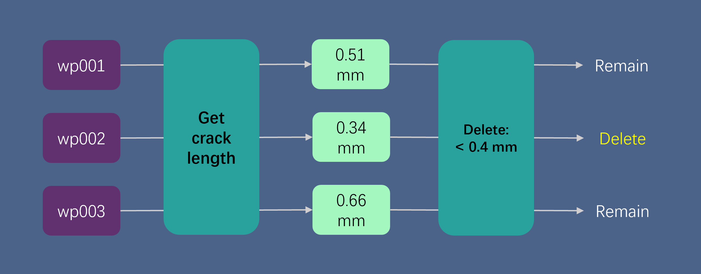
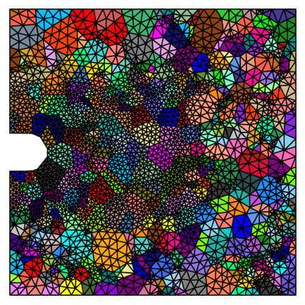

# PolycrystalFatigueCrackSim
- [Click here for the English Version.](#introduction)
## 0. 介绍
该仓库包含用于批量生成二维多晶RVE模型和有限元分析操作的脚本。这些脚本用于模拟多晶材料中的疲劳裂纹扩展。所涉及的软件包括 Neper 4.9.0、Gmsh 4.13.1 和 Abaqus 2022。Neper 和 Gmsh 在通过 WSL 安装的 Ubuntu 上运行，相关安装说明可在参考文献部分找到。另外，脚本需要在 Python 环境下运行本，所需 Python 包请查看 `requirements.txt` 。该脚本还不够完善，许多参数的设定和机理的选择仍有待推敲，唯希望给你一点启发或参考。

## 1. `simulation_utils`：

### 预处理：
0. **设置 `config.json`**
    - 设置工作区的路径，或者使用我的默认工作区。把 `monitor.ps1`, `startup.bat` 和 `subroutines3_revised.for` 添加到你的工作区，之后我会介绍这些文件的作用。
    - 决定晶界类型（平滑或不平滑）。其中平滑晶界模型的网格划分用到了 Gmsh 和相应的脚本，大概原理是先划分三角网格，然后将三角重新组合为四边形；非平滑模型的网格类似于EBSD的栅格化数据形式。不过此处并没有提供将EBSD转化为多晶模型的脚本，但是可以试着先将其转化为 .tser 文件类型（推荐逛逛 Neper 的 GitHub 讨论区，那里有挺多宝贵的建模经验）。
    - 
1. **运行 `scriptGenerator.py`**
    - 该脚本可创建多晶模型批量生成脚本 `neper.sh`，这个批处理脚本通过改变 `Neper` 的 `-T` 命令中的 `-id` 参数生成了晶粒分布不同的模型，并划分好网格。另外，在工作目录中还会生成多个名称为 `wpXXX` 的子工作目录。但是 `scriptGenerator.py` 目前不生成 Abaqus 运算的启动脚本 `startup.bat`，该脚本位于 `workplace` 文件夹中。
    - *注意*：几何模型以及晶粒的形状、尺寸均可在此脚本中所涉及的 Neper 命令行中修改。方便起见，可自行将这些参数放入 `config.json` 文件中，并在 `scriptGenerator.py` 中读取这些参数。
2. **在 Ubuntu 终端命令行中切换到 `neper.sh` 所在目录，然后输入以下命令：**
    ```bash
    ./neper.sh
    ```
    - *注意*：不同系统的换行符不同，可能会导致脚本执行错误。`scriptGenerator.py` 已解决此问题。如有需要，可以在 Ubuntu 终端命令行中转换：
    ```bash
    sed -i 's/\r$//' neper.sh
    ```
3. **运行 `editInp1.py`**
    - 此脚本向 `inp` 文件中添加材料信息。同时可以设置第二个随机数种子，即晶体取向随机数种子。
4. **运行 `preprocessor.py`**
    - 此脚本设置各种模拟参数，如分析步和边界条件。
    - *注意*：若运行时提示“输入行太长 命令语法不正确”，可将 `abq2022.bat` 中的调用编译器命令注释掉，运行完毕再启用。如下图使用 `rem` 注释掉了两条调用 VS 和 Fortran 的命令。
    
5. **运行 `editInp2.py`**
    - 此脚本批量修改某些参数，具体可打开脚本查看。

### 执行运算：
6. **运行 `startup.bat`**
    - 该批处理脚本位于 `workplace`，用于向 Abaqus 提交任务。脚本中默认运行 `wp001` 到 `wp100` 的运算，另外，为了节省存储空间会将 Abaqus 生成的 `.dat` 和 `.stt` 文件删除。你可以按需修改 `startup.bat`。另外，当前启动批处理可以监控命令窗口（见 `workplace` 中的 `monitor.ps1`），并解决因奇异矩阵（singular matrix）问题导致的计算停滞。

### 后处理：
7. **运行 `postprocessor1.py`**
    - 此脚本用于筛选不符合长度标准的裂纹。该脚本从 Odb 文件的最后一帧提取 `philsm` 信息，分析裂纹长度是否符合指定标准，并删除不符合标准的文件夹。
    
8. **运行 `postprocessor2.py`**
    - 最终帧的裂纹图像可能会出现往回拐的路径，这往往不符合我们的要求。因此，此脚本设计用于识别裂纹回拐之前的关键帧并生成图像。该脚本从 Odb 文件的选定帧中提取 `philsm` 信息，并生成 EBSD 和裂纹图像。
    
9. **运行 `postprocessor3.py`**
    - 此脚本用于手动识别裂纹回拐之前的关键帧。前两个脚本通常能产生符合长度标准且不含弯曲部分的裂纹，但仍有少数情况需要手动干预。

## 2. UMAT 和 UDMGINI 说明：
- `subroutines3_revised.for` 位于 `workplace`，除了原始版本 `huang_umat_97.for` 中含有的隐式 `UMAT` 外，还添加了控制损失起始的 `UDMGINI` 和早停机制，并根据 https://www.zhihu.com/question/45491271/answer/1192511740 将 `UMAT` 的某些项乘以2进行修正。
- 此处 `UDMGINI` 的机理是比较（FCC/BCC）晶体的 12 个滑移系（4 滑移面 × 3 滑移方向）上的累计塑性应变值，找出最大的其滑移系所对应的滑移面（四个中的一个）传递给 Abaqus 控制的主程序。

## 3. Neper 案例：
- 这里展示了一些 Neper 案例，可能有助于构建多晶模型。
    ```bash
    neper -T -n from_morpho -dim 2 -morpho "diameq:lognormal(0.07923,0.02839),1-sphericity:lognormal(0.14,0.07)" -domain "square(1.5,1.5)" -transform "cut(cube(-0.2,0.2,0.65,0.85,-1,1,0.1))" -reg 1 -id 2 -o notched_poly
    ```  
    
    ```bash
    neper -M notched_poly.tess -nset edges -cledge "(y>0.25&&y<0.75&&x>-0.01&&x<1.0)?0.05:0.08" -order 1 -format msh -o notched_poly_msh
    ```
    

## 4. 参考文献：
- Abaqus:
    - https://www.bilibili.com/video/BV1z34y1B7mc/?share_source=copy_web&vd_source=f0f26d78a8c687fafec0191a99a75a1a
- Neper&Gmsh:
    - https://www.bilibili.com/video/BV1cq4y1G7vt/?share_source=copy_web&vd_source=f0f26d78a8c687fafec0191a99a75a1a
    - https://neper.info/index.html
    - https://github.com/neperfepx/neper/discussions
- 文章：
    - Guo, H. H., Lu, R. S., Liu, F., Cui, W., Shen, J., Yang, J., & Zhang, X. C. (2023). Microscopic fatigue crack propagation model for polycrystalline alloys. International Journal of Fatigue, 170, 107526.
    - Guo, G., Jiang, W., Liu, X., Chen, J., Li, L., Wang, J., ... & Zhang, Z. (2023). In-situ SEM-EBSD investigation of the low-cycle fatigue deformation behavior of Inconel 718 at grain-scale. Journal of Materials Research and Technology, 24, 5007-5023.
    - Guo, H. H., Lu, R. S., Liu, F., Cui, W., Shen, J., Yang, J., & Zhang, X. C. (2023). Microscopic fatigue crack propagation model for polycrystalline alloys. International Journal of Fatigue, 170, 107526.

---

## Introduction
This repository contains scripts for the batch generation of 2D polycrystalline RVE models and finite element analysis operations. These scripts are used to simulate the growth of fatigue cracks in polycrystalline materials. The involved software includes Neper 4.9.0, Gmsh 4.13.1, and Abaqus 2022. Neper and Gmsh are run on Ubuntu installed via WSL, and the related installation instructions can be found in the References section. Additionally, the script needs to be run in a Python environment. Please refer to the `requirements.txt` file for the Python packages that need to be installed. This script is still not fully developed, and the setting of many parameters as well as the selection of mechanisms require further refinement. I only hope this provides you with some inspiration or reference.

## 1.simulation_utils:

### Preprocessing:
0. **Set `config.json`**
    - Set your workplace path, or use the default workplace path. Add `monitor.ps1`, `startup.bat`, and `subroutines3_revised.for` to your workplace, and I will explain the functions of these files shortly.
    - Decide the type of grain boundary (smooth or non-smooth). For smooth grain boundary models, the meshing uses Gmsh and the corresponding scripts, where the basic principle is to first generate triangular meshes and then recombine them into quadrilaterals. For non-smooth models, the mesh resembles the gridded data format of EBSD. However, the script for converting EBSD data into polycrystalline models is not provided here. You can try converting it to the .tser file format first (it's recommended to check out Neper's GitHub discussion forum, where you'll find plenty of valuable modeling experiences).
    
1. **Run `scriptGenerator.py`**
    - This script generates the batch polycrystal model generation script `neper.sh`. This batch script generates models with different grain distributions by changing the `-id` parameter in the `-T` command of `Neper` and also performs the meshing. However, `scriptGenerator.py` does not currently generate the Abaqus operation startup script, `startup.bat`, which is now located in the `workplace` folder.
    - *Note*：The geometry model, as well as the shape and size of the grains, can be modified in the Neper command lines involved in this script. For convenience, you can add these parameters to the config.json file and have them read in the `scriptGenerator.py` script.
2. **Change the directory to where `neper.sh` is located in the Ubuntu command line, then enter the following command:**
    ```bash
    ./neper.sh
    ```
    - *Note:* Different systems have different line break characters, which may cause script execution errors. `scriptGenerator.py` has resolved this issue. If needed, you can convert it in the Ubuntu command line with:
    ```bash
    sed -i 's/\r$//' neper.sh
    ```
3. **Run `editInp1.py`**
    - This script adds material information to the `inp` file. You can also set a second random seed, which is the random seed for the crystal orientation.
4. **Run `preprocessor.py`**
    - This script sets various simulation parameters such as analysis steps and boundary conditions.
    - *Note:* If you receive the message "The input line is too long. The syntax of the command is incorrect" during execution, you can comment out the compiler calls in `abq2022.bat`, run it, and then enable them again. As shown in the image, use `rem` to comment out the two commands that call Visual Studio and Fortran.
    
5. **Run `editInp2.py`**
    - This script batch modifies certain parameters.

### Execution:
6. **Run `startup.bat`**
    - This script batch is located in the `workplace` and is used to submit the jobs to Abaqus. By default, the script runs computations from `wp001` to `wp100`, and it deletes the `.dat` and `.stt` files generated by Abaqus to save storage space. You can modify `startup.bat` according to your need. Additionally, the current startup batch is capable of monitoring the command window (see `monitor.ps1` in `workplace`) and resolving stalls caused by Singular Matrix issues.

### Post-processing:
7. **Run `postprocessor1.py`**
    - This script is used to filter out cracks that do not meet the length standard. This script extracts the `philsm` information from the last frame of the Odb file, analyzes whether the crack length meets the specified standard, and deletes any folders that do not meet the standard.
    
8. **Run `postprocessor2.py`**
    - The crack image in the final frame may have a path that turns back, which does not meet our requirements. Therefore, this script is designed to identify key frames before the crack turns back and to generate plots. This script extracts the `philsm` information from selected frames of the Odb file and generates EBSD and crack images.
    
9. **Run `postprocessor3.py`**
    - This script is used to manually identify key frames before the crack turns back. While the first two scripts generally produce cracks that meet the length standard and do not contain curved sections, there are still a few cases that require manual intervention.

## 2.UMAT and UDMGINI Instructions:
- `subroutines3_revised.for` is located in the `workplace`. In addition to the implicit `UMAT` from the original version `huang_umat_97.for`, it incorporates an an early-stopping mechanism includes the subroutine `UDMGINI`, which controls the initiation of damage. Certain terms in `UMAT` have been revised by multiplying by 2 according to https://www.zhihu.com/question/45491271/answer/1192511740.
- The mechanism of `UDMGINI` involves comparing the accumulated plastic strain values across the twelve slip systems (4 slip planes × 3 slip directions) of the (FCC/BCC) crystal. The slip plane corresponding to the slip system with the largest accumulated strain is identified and passed to the main program controlled by Abaqus.

## 3.Neper Cases:
- Some neper cases are shown here, which might help you to build polycrystalline models.
    ```bash
    neper -T -n from_morpho -dim 2 -morpho "diameq:lognormal(0.07923,0.02839),1-sphericity:lognormal(0.14,0.07)" -domain "square(1.5,1.5)" -transform "cut(cube(-0.2,0.2,0.65,0.85,-1,1,0.1))" -reg 1 -id 2 -o notched_poly
    ```  
    
    ```bash
    neper -M notched_poly.tess -nset edges -cledge "(y>0.25&&y<0.75&&x>-0.01&&x<1.0)?0.05:0.08" -order 1 -format msh -o notched_poly_msh
    ```
    
## 4.References:
- Abaqus:
    - https://www.bilibili.com/video/BV1z34y1B7mc/?share_source=copy_web&vd_source=f0f26d78a8c687fafec0191a99a75a1a
- Neper&Gmsh:
    - https://www.bilibili.com/video/BV1cq4y1G7vt/?share_source=copy_web&vd_source=f0f26d78a8c687fafec0191a99a75a1a
    - https://neper.info/index.html
    - https://github.com/neperfepx/neper/discussions
- Articles:
    - Guo, H. H., Lu, R. S., Liu, F., Cui, W., Shen, J., Yang, J., & Zhang, X. C. (2023). Microscopic fatigue crack propagation model for polycrystalline alloys. International Journal of Fatigue, 170, 107526.
    - Guo, G., Jiang, W., Liu, X., Chen, J., Li, L., Wang, J., ... & Zhang, Z. (2023). In-situ SEM-EBSD investigation of the low-cycle fatigue deformation behavior of Inconel 718 at grain-scale. Journal of Materials Research and Technology, 24, 5007-5023.
    - Guo, H. H., Lu, R. S., Liu, F., Cui, W., Shen, J., Yang, J., & Zhang, X. C. (2023). Microscopic fatigue crack propagation model for polycrystalline alloys. International Journal of Fatigue, 170, 107526.
