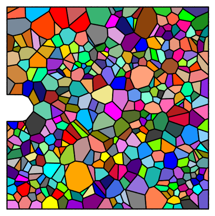

# PolycrystalFatigueCrackSim

This repository contains scripts for the batch generation of 2D polycrystalline RVE models and finite element analysis operations. These scripts are used to simulate the growth of fatigue cracks in polycrystalline materials. The involved software includes Neper 4.9.0, Gmsh 4.13.1, and Abaqus 2022.

## 1.simulation_utils:

### Preprocessing:
0. **Set `config.json`**
    - **Note:** Set your workplace path and decide the type of grain boundary (smooth or non-smooth).
1. **Run `scriptGenerator.py`**
    - **Note:** This script generates the batch polycrystal model generation script `neper.sh`. However, it does not currently generate the Abaqus operation startup script, `startup.bat`, which is now located in the `workplace` folder.
2. **Change the directory to where `neper.sh` is located in the Ubuntu command line, then enter the following command:**
    ```bash
    ./neper.sh
    ```
    - **Note:** Different systems have different line break characters, which may cause script execution errors. `scriptGenerator.py` has resolved this issue. If needed, you can convert it in the Ubuntu command line with:
    ```bash
    sed -i 's/\r$//' neper.sh
    ```
3. **Run `editInp1.py`**
    - **Note:** This script adds material information to the `inp` file.
4. **Run `preprocessor.py`**
    - **Note:** This script sets various simulation parameters such as analysis steps and boundary conditions.
5. **Run `editInp2.py`**
    - **Note:** This script batch modifies certain parameters.

### Execution:
6. **Run `startup.bat`**
    - **Note:** This script batch is located in a folder named `workplace` and submits the jobs to Abaqus. The current startup batch is capable of monitoring the command window (see `monitor.ps1` in `workplace`) and resolving stalls caused by Singular Matrix issues.

### Post-processing:
7. **Run `postprocessor1.py`**
    - **Note:** This script is used to filter cracks that meet the length standard. This script extracts the `philsm` information from the last frame of the Odb file, analyzes whether the crack length meets the specified standard, and deletes any folders that do not meet the standard.
8. **Run `postprocessor2.py`**
    - **Note:** This script is used to identify key frames before and after the crack curves and to generate plots. This script extracts the `philsm` information from selected frames of the Odb file and generates EBSD and crack images.
9. **Run `postprocessor3.py`**
    - **Note:** This script is used to manually identify key frames before and after the crack curves. While the first two scripts generally produce cracks that meet the length standard and do not contain curved sections, there are still a few cases that require manual intervention.

## 2.UMAT Instructions:
- `subroutines3_revised.for` is located in the `workplace`, which adds an early-stopping mechanism to the original version `huang_umat_97.for` and is revised by multiplying certain terms by 2 according to https://www.zhihu.com/question/45491271/answer/1192511740

## 3.Neper Cases:
- Some neper cases are shown here, which might help you to build polycrystalline models.
    ```bash
    neper -T -n from_morpho -dim 2 -morpho "diameq:lognormal(0.07923,0.02839),1-sphericity:lognormal(0.14,0.07)" -domain "square(1.5,1.5)" -transform "cut(cube(-0.2,0.2,0.65,0.85,-1,1,0.1))" -reg 1 -id 2 -o notched_poly
    ```  
    
    ```bash
    neper -M notched_poly.tess -nset edges -cledge "(y>0.25&&y<0.75&&x>-0.01&&x<1.0)?0.05:0.08" -order 1 -format msh -o notched_poly_msh
    ```
    
## 4.References:
- Abaqus:
    - https://www.bilibili.com/video/BV1z34y1B7mc/?share_source=copy_web&vd_source=f0f26d78a8c687fafec0191a99a75a1a
- Neper&Gmsh:
    - https://www.bilibili.com/video/BV1cq4y1G7vt/?share_source=copy_web&vd_source=f0f26d78a8c687fafec0191a99a75a1a
    - https://neper.info/index.html
    - https://github.com/neperfepx/neper/discussions
- Articles:
    - Guo, H. H., Lu, R. S., Liu, F., Cui, W., Shen, J., Yang, J., & Zhang, X. C. (2023). Microscopic fatigue crack propagation model for polycrystalline alloys. International Journal of Fatigue, 170, 107526.
    - Guo, G., Jiang, W., Liu, X., Chen, J., Li, L., Wang, J., ... & Zhang, Z. (2023). In-situ SEM-EBSD investigation of the low-cycle fatigue deformation behavior of Inconel 718 at grain-scale. Journal of Materials Research and Technology, 24, 5007-5023.
